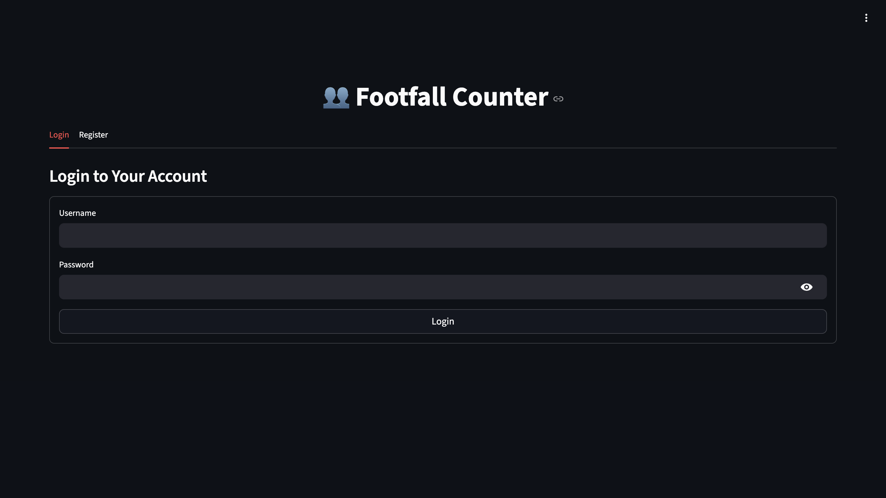
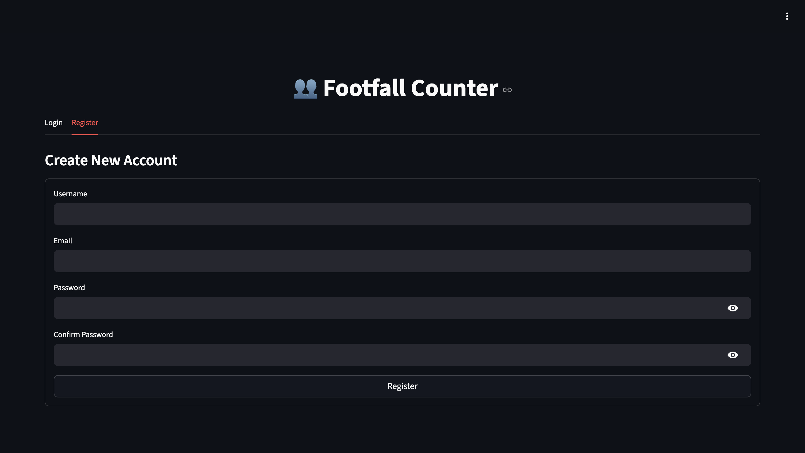
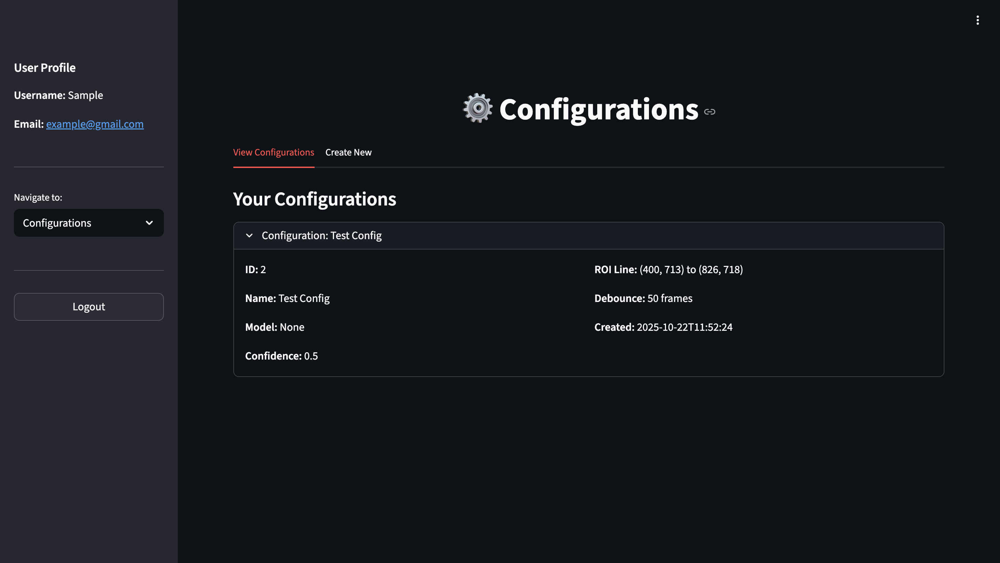
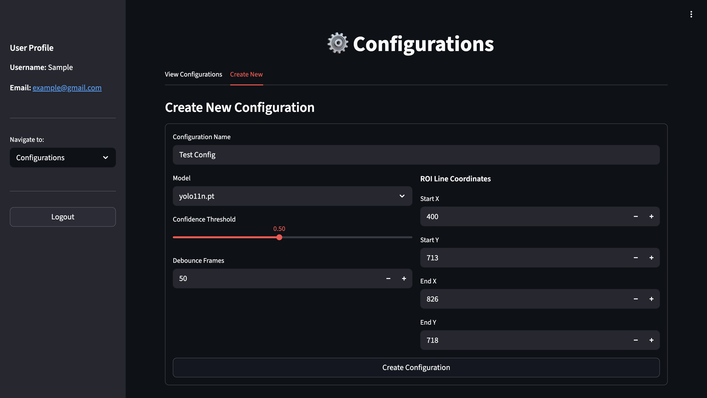
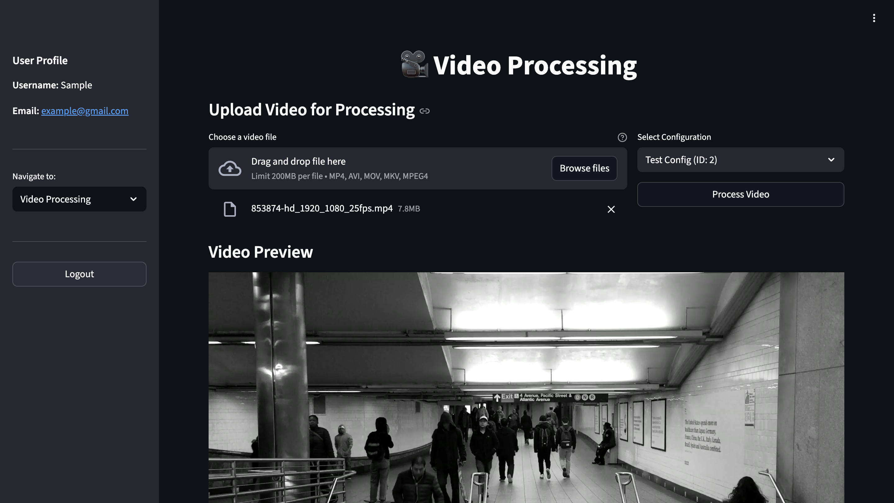
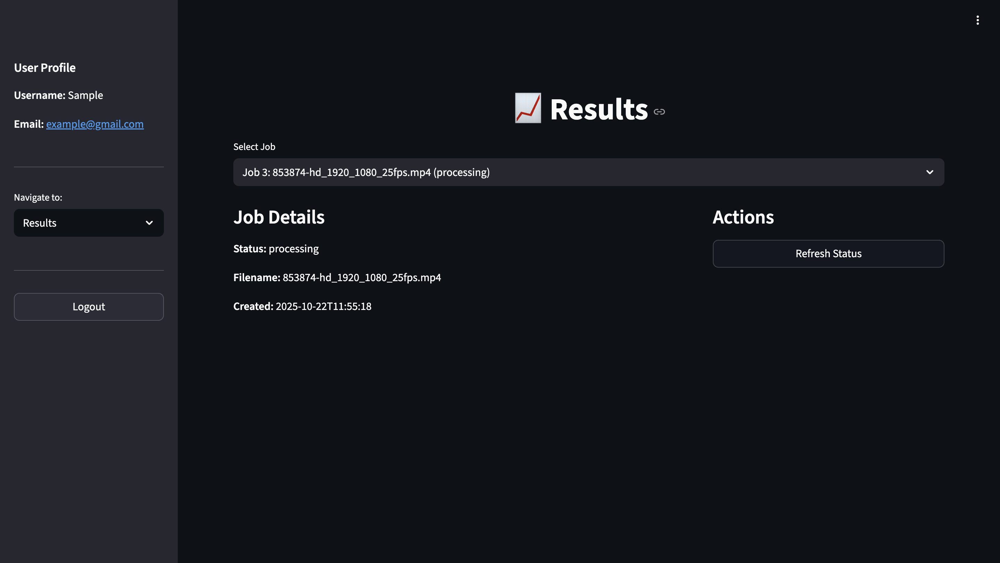
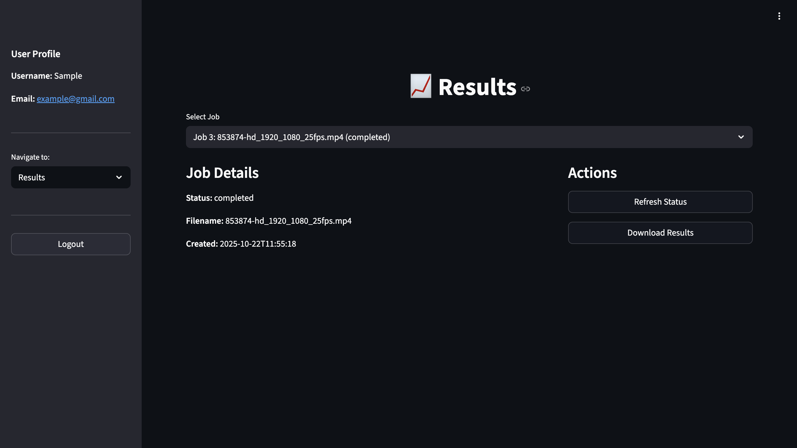
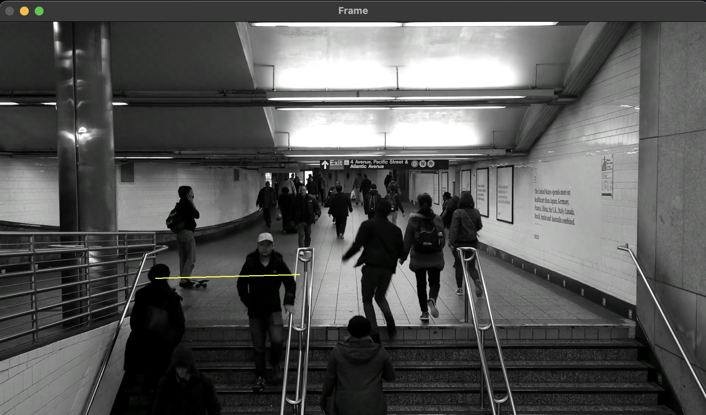

# 👥 Footfall Counter - Complete Computer Vision System

A comprehensive computer vision platform for counting people entering and exiting through doorways, gates, or other defined boundaries. Features YOLO11 object detection, BoT-SORT tracking, FastAPI backend, and an intuitive Streamlit web interface.

## 🎯 Overview

This project provides a complete footfall counting solution with:

### 🧠 **Core AI Engine**

- **YOLO11 Detection**: State-of-the-art person detection
- **BoT-SORT Tracking**: Advanced multi-object tracking across frames
- **Line-based ROI**: Precise entry/exit detection using line boundaries
- **Smart Debouncing**: Prevents duplicate counts with intelligent algorithms

### 🌐 **Web Platform**

- **FastAPI Backend**: RESTful API with authentication and job management
- **Streamlit Frontend**: Modern web interface for configuration and monitoring
- **Real-time Processing**: Live video stream analysis capabilities
- **User Management**: Multi-user support with secure authentication

### 📊 **Analytics & Visualization**

- **Interactive Dashboard**: Real-time metrics and job status monitoring
- **Results Visualization**: Charts and graphs for entry/exit analytics
- **Video Downloads**: Processed videos with annotations and overlays
- **Configuration Management**: Easy setup and parameter tuning

## 🎬 Demo & Screenshots

### Web Interface


*Login page for authentication*


*Register page for new users*


*Interactive dashboard showing real-time metrics and job status*



*Easy configuration setup with ROI line definition*


*Video upload and processing interface*



*Job results with download options*

### Processing Results


*Interactive ROI line creation tool*


*Sample output with person tracking and count overlay*

## 🚀 Key Features

### 🎯 **Detection & Tracking**

- **Line-based ROI Detection**: Uses a simple line boundary instead of rectangular regions for more accurate entry/exit detection
- **Real-time Processing**: Optimized for live video streams and recorded footage
- **Robust Tracking**: BoT-SORT algorithm maintains consistent person identities even through occlusions
- **Visual Feedback**: Real-time display of entry/exit events and running counts

### 🌐 **Web Interface**

- **User Authentication**: Secure login and registration system
- **Configuration Management**: Create and manage multiple ROI configurations
- **Video Upload**: Easy drag-and-drop video processing
- **Job Monitoring**: Real-time processing status and progress tracking
- **Results Download**: Download processed videos with annotations

### ⚙️ **Advanced Features**

- **Interactive ROI Setup**: GUI tool for easily defining counting boundaries on video frames
- **Configurable Parameters**: Adjustable confidence thresholds, debounce periods, and tracking settings
- **Multi-user Support**: Separate configurations and jobs for different users
- **RESTful API**: Complete API for integration with other systems
- **Real-time WebSocket**: Live processing updates and streaming capabilities

## 📁 Project Structure

```text
Footfall-Counter-using-Computer-Vision/
├── app/                            # FastAPI Backend Application
│   ├── api/v1/endpoints/          # API route handlers
│   │   ├── auth.py               # Authentication endpoints
│   │   ├── configurations.py     # Configuration management
│   │   ├── processing.py         # Video processing endpoints
│   │   ├── users.py             # User management
│   │   └── websocket.py         # WebSocket for real-time updates
│   ├── core/                     # Core application logic
│   │   ├── auth.py              # Authentication & JWT handling
│   │   ├── config.py            # Application configuration
│   │   └── database.py          # Database connection & setup
│   ├── models/                   # SQLAlchemy database models
│   │   ├── user.py              # User model
│   │   ├── configuration.py     # Configuration model
│   │   └── processing_job.py    # Processing job model
│   ├── schemas/                  # Pydantic request/response schemas
│   ├── services/                 # Business logic services
│   │   ├── footfall_tracker.py  # Core tracking algorithm
│   │   └── video_processor.py   # Video processing service
│   └── main.py                   # FastAPI application entry point
├── data/                          # Video files and sample data
│   ├── 853874-hd_1920_1080_25fps.mp4  # Sample input video
│   └── roi_line_frame.jpg         # ROI visualization frame
├── docs/                          # Documentation and demo images
│   └── images/                    # Screenshots and demo images
├── notebooks/                     # Jupyter notebooks
│   ├── footfall_counter_v1.ipynb # Main implementation notebook
│   └── tracking_output_*.mp4      # Generated output videos
├── scripts/                       # Utility scripts
│   └── zone_creation.py          # Interactive ROI line creation tool
├── streamlit_app.py              # Streamlit web interface
├── streamlit_realtime.py         # Real-time processing components
├── run_ui.py                     # Startup script for web services
├── run.py                        # FastAPI server runner
├── botsort.yaml                  # BoT-SORT tracker configuration
├── requirements.txt              # Python dependencies
├── Makefile                      # Build and utility commands
├── README.md                     # This documentation
├── README_API.md                 # FastAPI backend documentation
└── README_UI.md                  # Streamlit UI documentation
```

## 🛠️ Installation & Quick Start

### Prerequisites

- **Python 3.8+**
- **Git** for cloning the repository
- **Modern web browser** for the Streamlit interface

### 🚀 Quick Setup (Recommended)

1. **Clone the repository**:

   ```bash
   git clone https://github.com/Shrijeeth/Footfall-Counter-using-Computer-Vision.git
   cd Footfall-Counter-using-Computer-Vision
   ```

2. **Install all dependencies**:

   ```bash
   make install
   ```

3. **Start the complete web application**:

   ```bash
   make run-ui
   ```

4. **Access the application**:
   - **Web Interface**: <http://localhost:8501>
   - **API Documentation**: <http://localhost:8000/docs>
   - **API Health Check**: <http://localhost:8000/health>

### 🔧 Alternative Installation Methods

#### Manual Installation

```bash
# Install Python dependencies
pip install -r requirements.txt

# Run FastAPI backend (Terminal 1)
python -m uvicorn app.main:app --host 0.0.0.0 --port 8000 --reload

# Run Streamlit frontend (Terminal 2)
streamlit run streamlit_app.py --server.port 8501
```

#### Development Setup

```bash
# Install with development tools
make dev-install

# Run linting and formatting
make format && make lint && make check
```

## 🎮 Usage Guide

### 🌐 Web Interface (Recommended)

1. **Start the application** with `make run-ui`

2. **Register/Login**:
   - Open <http://localhost:8501>
   - Create a new account or login with existing credentials

3. **Create Configuration**:
   - Navigate to "Configurations" tab
   - Set up ROI line coordinates (x1, y1, x2, y2)
   - Configure model parameters and thresholds
   - Save your configuration

4. **Process Videos**:
   - Go to "Video Processing" tab
   - Upload your video file (MP4, AVI, MOV, MKV)
   - Select a configuration
   - Monitor processing status in real-time

5. **View Results**:
   - Check "Results" tab for completed jobs
   - View interactive analytics and charts
   - Download processed videos with annotations

### 🔧 Traditional Method (Jupyter Notebook)

1. **Define ROI Line** (Interactive):

   ```bash
   make mark-video-zone VIDEO=data/853874-hd_1920_1080_25fps.mp4
   ```

   - Click and drag to draw a line across the entry/exit boundary
   - The tool will save the coordinates and generate a visualization

2. **Run Footfall Counter**:
   - Open `notebooks/footfall_counter_v1.ipynb` in Jupyter
   - Update the `video_roi` coordinates with your line coordinates
   - Run all cells to process the video and generate counts

### 🔌 API Integration

Use the RESTful API for custom integrations:

```python
import requests

# Upload video for processing
files = {"file": open("video.mp4", "rb")}
data = {"config_id": 1}
response = requests.post(
    "http://localhost:8000/api/v1/processing/upload-video",
    files=files,
    data=data,
    headers={"Authorization": "Bearer YOUR_TOKEN"}
)

# Check job status
job_id = response.json()["id"]
status = requests.get(f"http://localhost:8000/api/v1/processing/jobs/{job_id}")
```

### Advanced Usage

#### Custom Video Processing

```python
from ultralytics import YOLO

# Load model
model = YOLO("yolo11n.pt")

# Configure tracking
track_generator = model.track(
    source="your_video.mp4",
    classes=[0],  # Person class only
    conf=0.5,     # Confidence threshold
    tracker="botsort.yaml",
    stream=True
)

# Process with FootfallTracker
tracker = FootfallTracker(roi_line_coords, debounce_frames=50)
for tracks in track_generator:
    processed_frame = tracker.process_frame(tracks)
```

#### ROI Line Coordinates

The ROI is defined as a line with coordinates `(x1, y1, x2, y2)`:

- `(x1, y1)`: Start point of the line
- `(x2, y2)`: End point of the line
- People crossing this line trigger entry/exit events

## ⚙️ Configuration

### BoT-SORT Tracker Settings (`botsort.yaml`)

```yaml
tracker_type: botsort
track_high_thresh: 0.15    # First-stage match threshold
track_low_thresh: 0.1      # Second-stage threshold
new_track_thresh: 0.25     # New track creation threshold
track_buffer: 30           # Frames to keep lost tracks
match_thresh: 0.8          # Association similarity threshold
```

### Footfall Counter Parameters

- **Debounce Frames**: `50` (prevents duplicate counts for ~2 seconds at 25fps)
- **Confidence Threshold**: `0.5` (minimum detection confidence)
- **Person Class**: `0` (COCO dataset person class)

## 🔧 Development

### Code Quality

```bash
make format    # Format code with ruff
make lint      # Fix import sorting and basic issues
make check     # Run full linting check
```

### Project Commands

```bash
# Install dependencies
make install

# Install development dependencies
make dev-install

# Create ROI for a video
make mark-video-zone VIDEO=path/to/video.mp4
```

## 📊 Algorithm Details

### Detection Pipeline

1. **YOLO11 Detection**: Identifies people in each frame with bounding boxes
2. **BoT-SORT Tracking**: Assigns consistent IDs to people across frames
3. **Line Crossing Detection**: Checks if person's center and bounding box cross the ROI line
4. **Event Classification**: Determines if crossing is entry or exit based on direction
5. **Debouncing**: Prevents duplicate counts from the same person within debounce period

### Counting Logic

- **Entry**: Person moves from one side of the line to the other (direction depends on line orientation)
- **Exit**: Person moves in the opposite direction
- **Debouncing**: Same person cannot trigger another count for 50 frames (configurable)

## 🎥 Output

The system generates:

- **Annotated Video**: Original video with ROI line, bounding boxes, and count displays
- **Console Output**: Real-time entry/exit counts and final totals
- **Visual Feedback**: Green "ENTRY" and red "EXIT" labels on detected events

## 📚 Documentation

### 📖 **Complete Documentation Set**

- **[README.md](README.md)** - This main documentation (overview, installation, usage)
- **[README_API.md](README_API.md)** - FastAPI backend documentation (endpoints, authentication, deployment)
- **[README_UI.md](README_UI.md)** - Streamlit UI documentation (interface guide, features, troubleshooting)
- **[docs/images/README.md](docs/images/README.md)** - Demo images and screenshot guidelines

### 🔧 **Technical Documentation**

- **API Endpoints**: Complete REST API documentation at <http://localhost:8000/docs>
- **Database Schema**: User management, configurations, and job tracking
- **Algorithm Details**: YOLO11 detection + BoT-SORT tracking implementation
- **Configuration Guide**: ROI setup, parameter tuning, and optimization

### 📊 **Performance & Optimization**

- **System Requirements**: Minimum hardware specifications
- **Scaling Guidelines**: Multi-user deployment and load balancing
- **Troubleshooting**: Common issues and solutions
- **Best Practices**: Video quality, ROI placement, and parameter selection

## 🚀 Deployment Options

### 🖥️ **Local Development**

```bash
# Quick start for development
make run-ui
```

### 🌐 **Production Deployment**

```bash
# Docker deployment (coming soon)
docker-compose up -d

# Manual production setup
python -m uvicorn app.main:app --host 0.0.0.0 --port 8000
streamlit run streamlit_app.py --server.port 8501 --server.address 0.0.0.0
```

### ☁️ **Cloud Deployment**

- **Heroku**: Ready for Heroku deployment with Procfile
- **AWS/GCP**: Compatible with cloud container services
- **Docker**: Containerized deployment (configuration included)

### 🔄 **Development Workflow**

1. **Fork** the repository
2. **Create** a feature branch (`git checkout -b feature/amazing-feature`)
3. **Make** your changes with proper testing
4. **Run** quality checks (`make format && make lint && make check`)
5. **Commit** your changes (`git commit -m 'Add amazing feature'`)
6. **Push** to the branch (`git push origin feature/amazing-feature`)
7. **Open** a Pull Request

### 🎯 **Areas for Contribution**

- **Algorithm improvements**: Enhanced tracking accuracy
- **UI/UX enhancements**: Better user interface design
- **Performance optimization**: Faster processing algorithms
- **New features**: Real-time streaming, mobile support
- **Documentation**: Tutorials, examples, and guides
- **Testing**: Unit tests, integration tests, performance tests

## 🙏 Acknowledgments

### 🤖 **AI & Computer Vision**

- **[Ultralytics YOLO](https://ultralytics.com/)**: State-of-the-art object detection framework
- **[BoT-SORT](https://github.com/NirAharon/BoT-SORT)**: Advanced multi-object tracking algorithm
- **[OpenCV](https://opencv.org/)**: Comprehensive computer vision library

### 🌐 **Web Technologies**

- **[FastAPI](https://fastapi.tiangolo.com/)**: Modern, fast web framework for building APIs
- **[Streamlit](https://streamlit.io/)**: Rapid web app development for data science
- **[SQLAlchemy](https://www.sqlalchemy.org/)**: Python SQL toolkit and ORM

### 🛠️ **Development Tools**

- **[Ruff](https://github.com/astral-sh/ruff)**: Fast Python linter and formatter
- **[Pydantic](https://pydantic-docs.helpmanual.io/)**: Data validation using Python type annotations

## 📞 Support & Community

### 🆘 **Getting Help**

- **GitHub Issues**: Report bugs and request features
- **Discussions**: Community support and questions
- **Documentation**: Comprehensive guides and API reference
- **Examples**: Sample implementations and tutorials

### 📧 **Contact**

For questions, issues, or contributions:

- 🐛 **Bug Reports**: [GitHub Issues](https://github.com/Shrijeeth/Footfall-Counter-using-Computer-Vision/issues)
- 💡 **Feature Requests**: [GitHub Discussions](https://github.com/Shrijeeth/Footfall-Counter-using-Computer-Vision/discussions)
- 📖 **Documentation**: Check existing docs in `notebooks/` and `README_*.md` files
- ⚙️ **Configuration Help**: Review `botsort.yaml` and configuration examples

### 🔓 **Open Source**

- ✅ **Commercial use** allowed
- ✅ **Modification** and **distribution** permitted
- ✅ **Private use** encouraged
- ❗ **No warranty** provided

---

## ⚠️ Important Notes

### 🎯 **Optimal Performance Conditions**

- **Controlled environments** with clear entry/exit points
- **Good lighting** conditions for accurate detection
- **Moderate crowd density** (avoid overcrowding)
- **Stable camera** positioning and angle

### 📈 **Performance Considerations**

- **Video quality** significantly impacts detection accuracy
- **ROI line placement** is critical for proper counting
- **Parameter tuning** may be needed for different scenarios
- **Hardware requirements** vary based on video resolution and frame rate

### 🔒 **Privacy & Security**

- **No personal data** is stored by default
- **Video processing** is done locally unless configured otherwise
- **User authentication** protects individual configurations
- **GDPR compliance** considerations for video data handling

## 🤝 Contributing

1. Fork the repository
2. Create a feature branch (`git checkout -b feature/amazing-feature`)
3. Commit your changes (`git commit -m 'Add amazing feature'`)
4. Push to the branch (`git push origin feature/amazing-feature`)
5. Open a Pull Request

## 📝 License

This project is licensed under the **MIT License** - see the [LICENSE](LICENSE) file for details.

---

**🎉 Ready to start counting? Run `make run-ui` and open <http://localhost:8501> to begin!**
